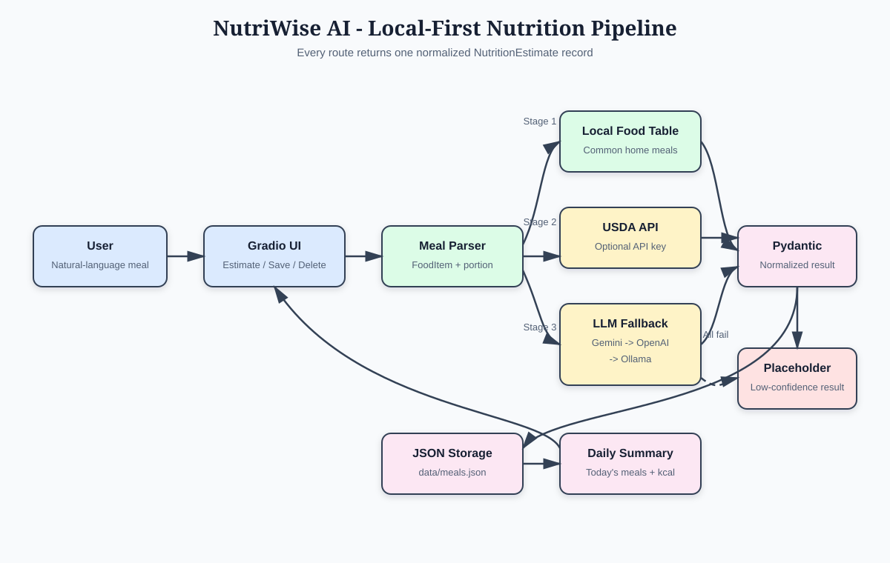

# NutriWise AI Project Report

## Introduction

NutriWise AI is a lightweight calorie tracker for people who want to record meals without searching a nutrition database for every ingredient. The user describes a meal in natural language, receives a structured estimate, and can save it to a local daily log.

The project is relevant to health technology because it reduces data-entry friction while communicating that home-cooked nutrition is inherently approximate.

## Implementation Overview

The application is split into three modules:

- `nutrition.py` parses portions, matches common home-cooked and Indian meals, optionally queries USDA FoodData Central, and falls back through Gemini, OpenAI, and Ollama.
- `storage.py` stores UUID-based records in `data/meals.json`, inserts new meals first, deletes by ID, and calculates today's calorie total.
- `app.py` exposes estimation, saving, deletion, the daily summary, and the saved-meals table through Gradio.

All estimates use the same Pydantic schema: name, calories, protein, carbs, fat, note, and source. The Healthy Meal Plan CSV is used as local meal-name vocabulary. Its numeric columns are normalized features rather than kcal or gram measurements, so they are not misrepresented as nutrition data.

## System Architecture

The application uses a local-first pipeline. The Gradio interface sends a meal description to the estimation service, which tries increasingly flexible data sources. Every successful path returns the same Pydantic model, so the user interface and storage layer do not need provider-specific logic.



*Figure 1. NutriWise AI estimation, fallback, normalization, and persistence flow.*

## Low-Level System Design

### Request flow

1. The user enters a natural-language description such as `2 cups lentil soup`.
2. `parse_food_items()` normalizes whitespace, splits combined foods, and extracts a numeric portion into `FoodItem` objects.
3. `estimate_meal()` runs the local food-table stage first. Fuzzy matching allows common variations in meal names.
4. If no local estimate is available, the optional USDA stage searches FoodData Central for each parsed item.
5. If USDA is unavailable or unresolved, `_estimate_llm()` tries Gemini, OpenAI, and Ollama in that order. Provider exceptions are caught so an unavailable service does not stop the application.
6. If every stage fails, a clearly labeled placeholder estimate is returned instead of raising an error.
7. The result is validated and normalized as `NutritionEstimate` before it reaches the UI.

### Core data models

```text
FoodItem
	name: string
	portion: string

NutritionEstimate
	name: string
	calories: non-negative number
	protein: non-negative number
	carbs: non-negative number
	fat: non-negative number
	note: string
	source: string
```

The saved JSON record extends `NutritionEstimate` with:

```text
MealRecord
	id: UUID
	date: ISO date
	created_at: ISO timestamp
	name, calories, protein, carbs, fat, note, source
```

### Persistence and tracking

`storage.py` reads and writes a JSON array at `data/meals.json`. Saving creates the directory when needed, prepends the new record, and assigns a UUID plus UTC timestamp. The daily summary filters records where `date` equals the current local date and sums their calorie values. Deletion removes only the record whose UUID matches the supplied ID.

The Gradio custom-food section writes user-provided rows to `data/user_foods.csv`, which uses the same headers as `data/healthy_meal_plans.csv`. Rows are upserted by normalized `meal_name`, so adding a name again modifies its details rather than creating a duplicate. The original course dataset is read-only. User rows are loaded before each local estimate and override built-in meal values when a match is found.

### Interface handlers

- `handle_estimate()` returns the latest normalized estimate for the JSON panel.
- `handle_save()` saves the displayed estimate, refreshes the table, and refreshes the daily summary.
- `handle_delete()` removes the requested UUID and refreshes the table and summary.
- `build_app()` connects these handlers to Gradio components and returns a reusable `Blocks` application.

### Configuration and failure handling

Provider settings are loaded from `.env` or the process environment. `GEMINI_API_KEY` and `GOOGLE_API_KEY` enable Gemini; `OPENAI_API_KEY` enables OpenAI; `OLLAMA_URL` and `OLLAMA_MODEL` configure the local Ollama endpoint. Missing keys, connection failures, malformed provider output, and unavailable APIs all fall through to the next stage. The final placeholder source makes low confidence visible to the user.

## Results

The automated tests verify a portion-aware local estimate, a no-provider placeholder estimate, and JSON persistence with today's filtering and deletion. The Gradio workflow provides:

- natural-language meal input;
- an estimate JSON panel;
- save and delete actions;
- a daily calorie summary;
- a table of saved meals with source and timestamps.

The application remains usable with no API key. Ollama can be configured locally with `OLLAMA_URL` and `OLLAMA_MODEL`; cloud providers are optional.

## Conclusion

NutriWise AI meets the local deployment requirements while keeping provider failures non-fatal. Its main limitation is that nutrition values for recipes depend on serving size, ingredients, and cooking method. Future versions could add ingredient-level USDA scaling, user-defined recipes, confidence scores, export to CSV, and a richer weekly report.